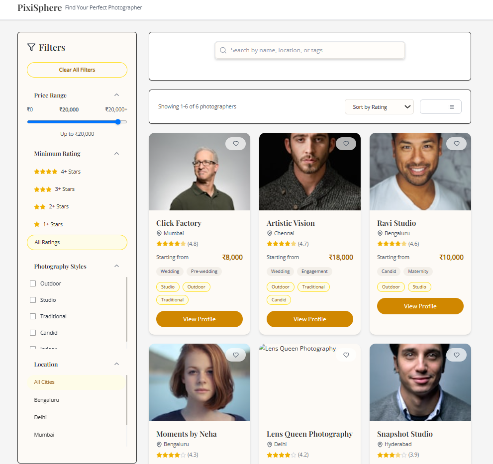
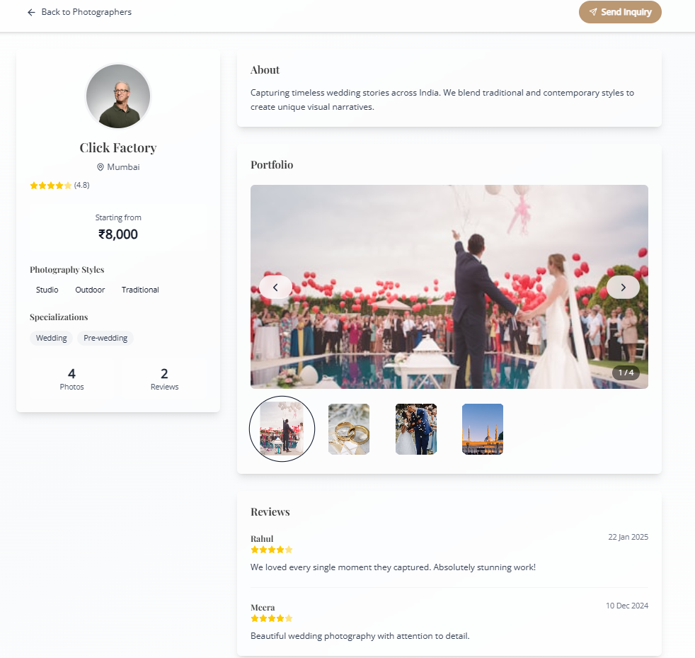
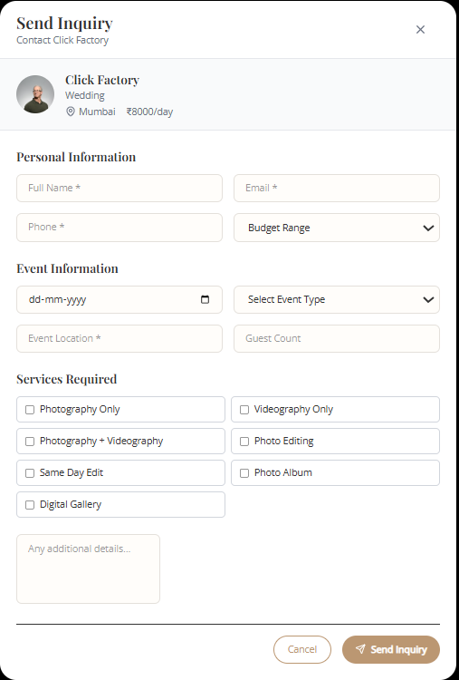

A quick view to the website:

## About the website: 

A platform that connects customers with the
best photographers and studios for maternity, newborn, birthday, and other special shoots.

## Setup Intruction:

1.git clone https://github.com/shashank0470/Assignment_ImpresioStudio.git

2.cd Assignment_ImpresioStudio

3.npm install

4.npm run dev

## Technology Used:

● Framework: React
● State Management: Context API, Redux,
● Styling: Tailwind CSS, Material UI, or custom CSS
● Other Features:
○ Debounced search/filter
○ Clean and responsive UI
○ Mobile-first best practices

## Live demo:

## Folder Structure:

pixisphere-app/
├── public/
│   └── index.html
├── src/
│   ├── components/
│   │   ├── PhotographerCard.jsx
│   │   ├── FilterSidebar.jsx
│   │   ├── SearchBar.jsx
│   │   ├── PhotographerProfile.jsx
│   │   └── InquiryModal.jsx
│   ├── context/
│   │   └── AppContext.jsx
│   ├── hooks/
│   │   └── useDebounce.js
│   ├── data/
│   │   └── mockData.js
│   ├── utils/
│   │   └── helpers.js
│   ├── App.jsx
│   ├── main.jsx
│   └── index.css
├── package.json
├── vite.config.js

